<h2 align="left">👋 Hi, I'm Carlos Alberto López</h2>

  💻 <strong>Software Developer | Full Stack</strong>

  Software Developer focused on building web applications and business-oriented solutions.
   
  Interested in software development, Cloud Computing, and building efficient and scalable solutions.

<h3>📊 GitHub Stats</h3>

  
  
  

<h3>🛠️ Technologies and Tools</h3>

  
  

  
  

  
  

  
  

  
  

  
  

  
  

  
  

  
  

  
  

  
  

  
  

  
  

  

<h3>🌐 Social</h3>

  

  

 

###

<picture data-importer="pacman">
  <source media="(prefers-color-scheme: dark)" srcset="https://raw.githubusercontent.com/carlosalbertolopez-dev/carlosalbertolopez-dev/pacman-output/pacman-contribution-graph-dark.svg?game=pacman">
  <source media="(prefers-color-scheme: light)" srcset="https://raw.githubusercontent.com/carlosalbertolopez-dev/carlosalbertolopez-dev/pacman-output/pacman-contribution-graph.svg?game=pacman">
  
</picture>

###
